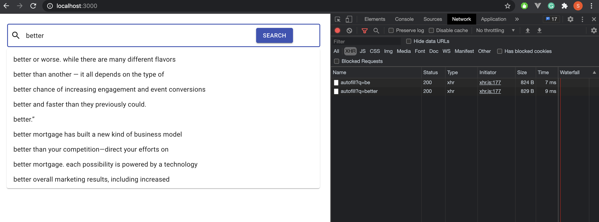
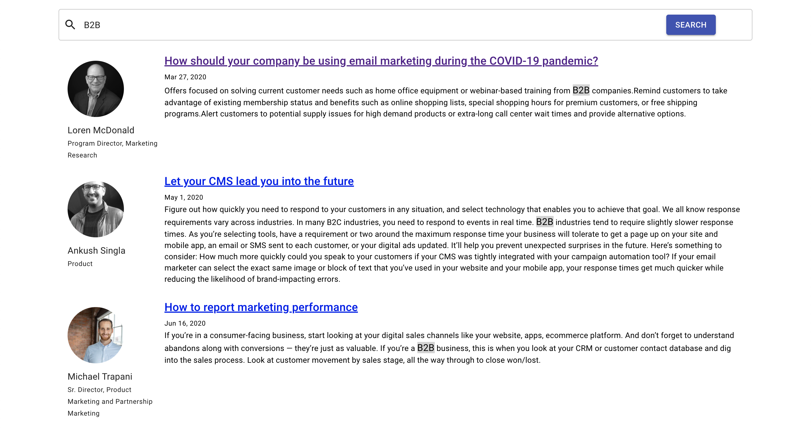
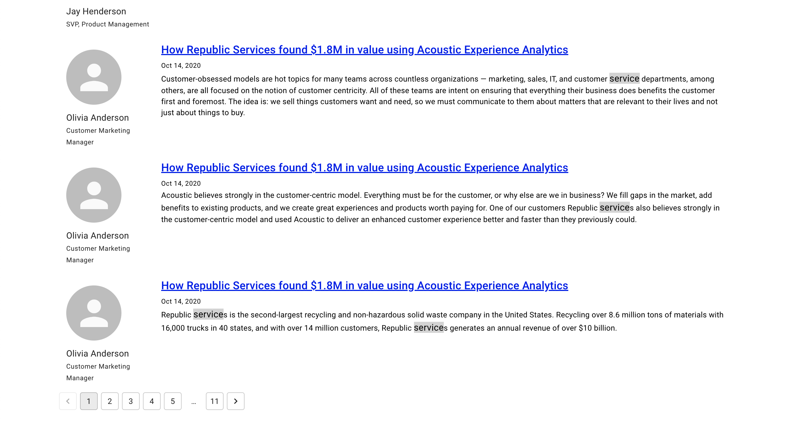
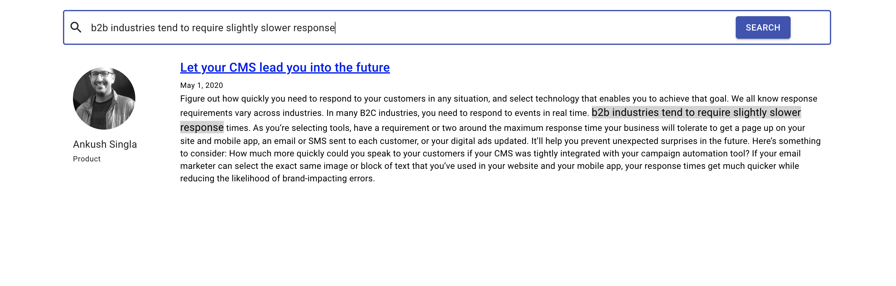

# acoustic-blog-search
Search Engine for Acoustic (acoustic.com) blogs using - spring boot, hsqldb, react 

## Folder Structure
1. blogs-crawler - Crawl blogs published on acoustic website.
2. blog-search-api - Expose REST API for autofill and blog search
3. blog-search-frontend-react - Frontend to search blog

## How to run locally?
1. Start ***blog-search-api*** spring boot application, it will load default data into in memory hsqldb on start automatically.
2. Start ***blog-search-frontend-react*** react app
3. Open browser and start searching acoustic blogs

## Blogs Crawler
1. Read sitemap https://acoustic.com/sitemap.xml
2. Parse xml and filter all urls containing 'blogs'
3. Using puppeteer render SPA and get contents from blog
4. Consider each Paragraph in blog as a separate entry in the database.
5. Dump all the data in separate JSON file (folder 'blogs-crawler/blogs')

## Screenshots

      

### React Search Component

      

### Autocomplete using 200ms debouncer (Check network tab)

      

### Search any text by clicking on 'search' button, it will display blog content along with author info

      

### Search has pagination support

      

### Search text highlighted in search result.
